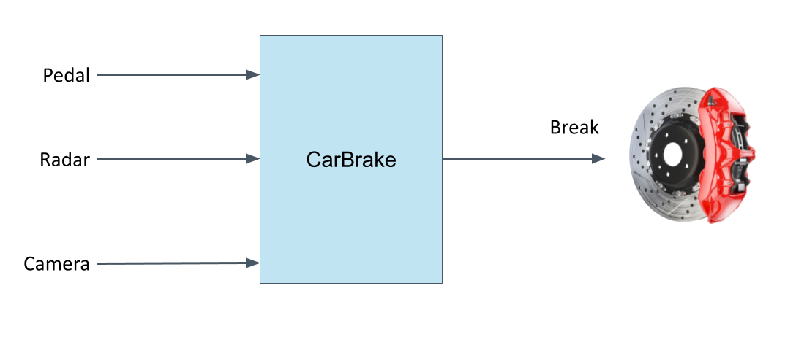

# CarBreak
Design a descision unit for a braking system!

The system shall have the following inputs:
* `pedal`
* `camera`
* `radar`

The system has only one output:
* `break`

All inputs and outputs are of `std_logic` type

The system shall respect the following requirements:
| Requirement ID | Description |
|----------------|-------------|
| 1 | Braking shall allways be activated when the **pedal-input** is active |
| 2 | Braking shall allways be activated when **radar and camera** inputs are active simultanious |
| 3 | Braking must **not** be activated by camera input alone |
| 4 | Braking must **not** be activated by radar input alone |

Start by creating a truth-tabel that satisfy the requirements above. From that conclude the boolean expression that corresponds to the truth-table. Finally code it in VHDL!