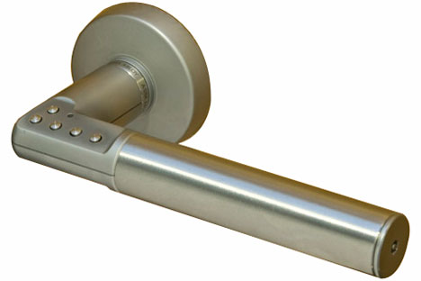
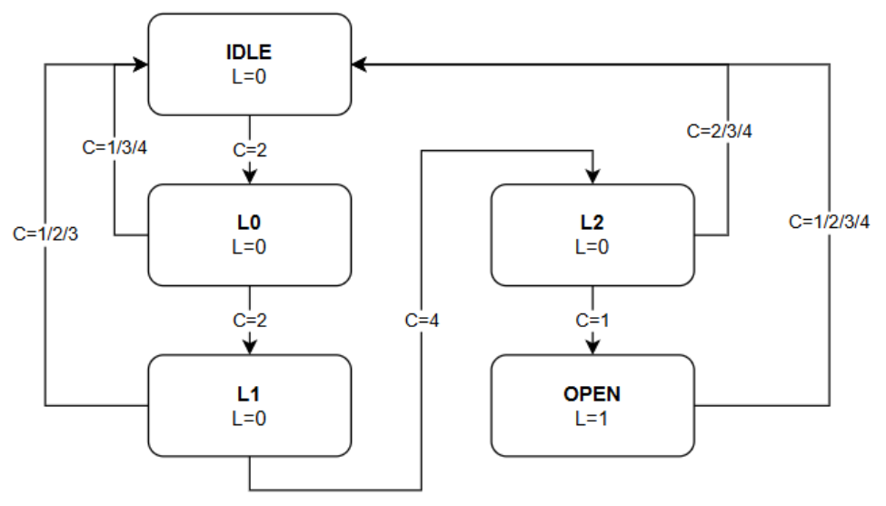

# Codelock

Design a basic codelock as a FSM (Finite State Machine)!

## Entity

|Name | Description | Direction | Data-type |
|-----|-------------|-----------|-----------|
|`clk`| 50 Mhz clock to drive flip-flops | `in` |`std_logic`|
|`rst`| Asynchronous reset flip-flops | `in` |`std_logic`|
|`rst`| Asynchronous reset flip-flops | `in` |`std_logic`|
|`c1` to `c4` | Key-pad numbers for dialing correct code, active low | `in` |`std_logic`|
|`lock`| Locking bolt, this signal goes high to unlock door when correct code has been dialed|`out`| `std_logic` |
|`ledr`| Debug outputs, can be omitted | `out` |`std_logic_vector(3 downto 0)`|

## Behaviour / Design
The design shall be based on a FSM. Orginally the FSM is in a `IDLE`-state and the lock is default locked (`lock <= '0'`). When a correct number is dialed (one of the inputs `c1` to `c4` goes low) the FSM changes state and after the 4:th correct number is dialed the FSM enters state `UNLOCK` and the lock is opened (`lock <= '1'`). The correct code shall be `2-2-4-1`.

